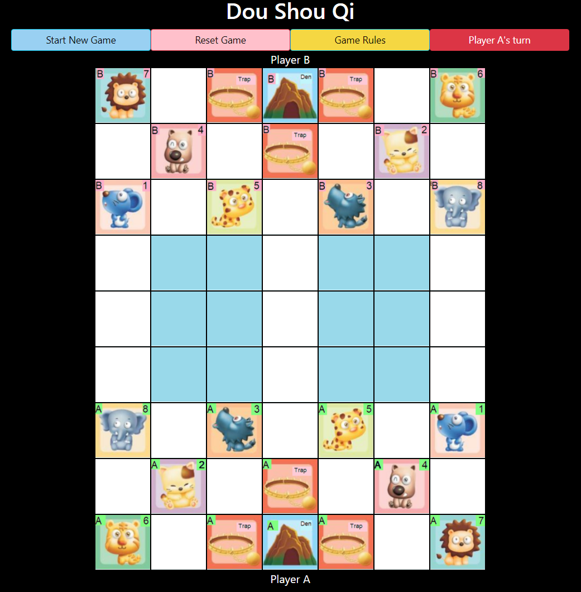

# Dou_Shou_Qi
> Objective: Develop a Javascript based game
> Live demo [_here_](https://dou-shou-qi.vercel.app/). <!-- If you have the project hosted somewhere, include the link here. -->

## Table of Contents
* [General Info](#general-information)
* [Technologies Used](#technologies-used)
* [Features](#features)
* [Screenshots](#screenshots)
* [Setup](#setup)
* [Usage](#usage)
* [Project Status](#project-status)
* [Room for Improvement](#room-for-improvement)
* [Acknowledgements](#acknowledgements)
<!-- * [License](#license) -->

## General Information
- A Javascript game based on a traditional chinese board game (Dou Shou Qi/Animal Chess/Jungle)
<!-- You don't have to answer all the questions - just the ones relevant to your project. -->

## Technologies Used
- jQuery -  Simplifies HTML document traversing, event handling, animating for rapid web development.
- Bootstrap - Extensive list of components and Bundled Javascript plugins.
- Javascript, CSS, Html

## Features
List the ready features here:
- Simple, easy to use interface
- Learn to play the game with prompts
- Interactive game

## Screenshots

<!-- If you have screenshots you'd like to share, include them here. -->

## Setup
Open the index.html in a browser

## Usage
Instructions are provided to navigate the menu.
Movement of pieces are initiated by clicking on the game board.
Highlighted grids will show the possible directions where each can move to.
Prompts will be provided when rules intervene.

## Project Status
Project is: _in progress. 

## Room for Improvement
Areas of improvement: Planning is critical for writing a efficient code. Probably need to take more time
to plan.

## Acknowledgements
Give credit here.
- This project was done referencing https://boardgamegeek.com/

<!-- Optional -->
<!-- ## License -->
<!-- This project is open source and available under the [... License](). -->
<!-- You don't have to include all sections - just the one's relevant to your project -->